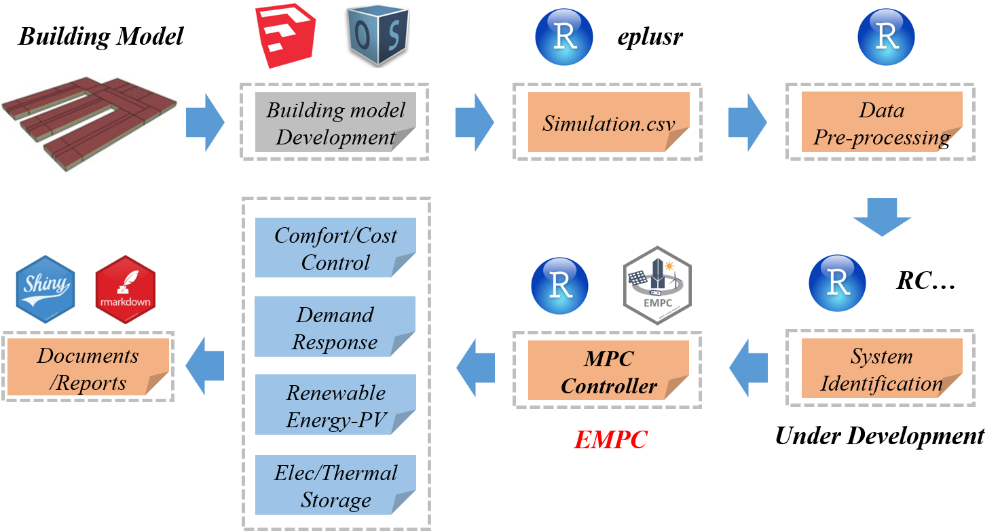
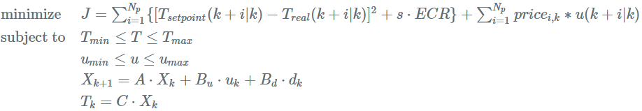
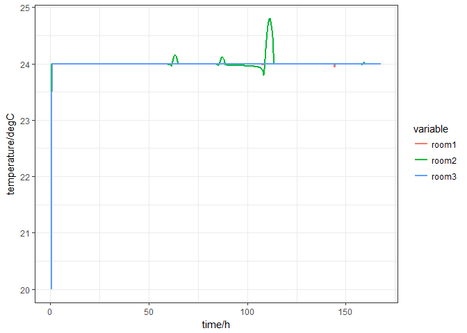
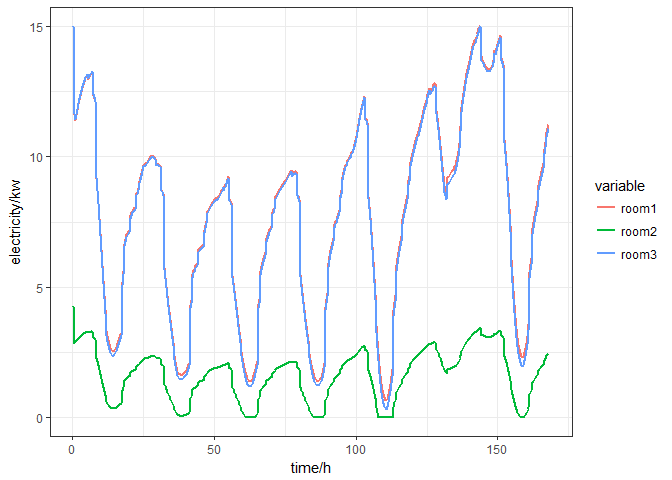
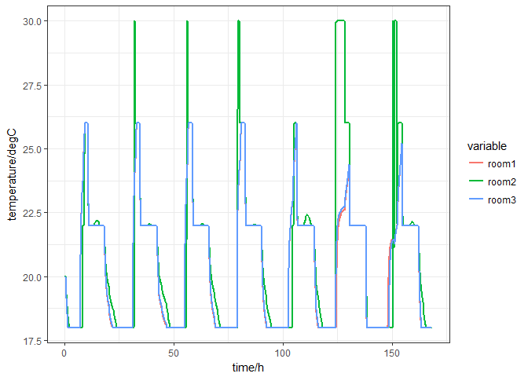
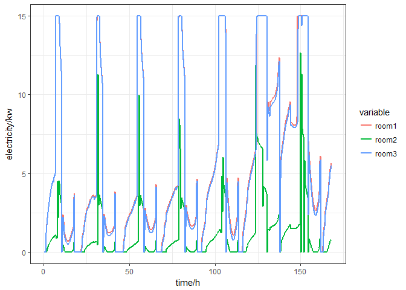

EMPC 
=========================================================

An R module aimed at **MPC** (model predictive control), **EMPC** (economics model predictive control), EMPC-based Demand Response and Energyhub modeling for buildings.

------------------------------------------------------------------------

-   [Framework for Building Simulation in R](#framework-for-building-simulation-in-r)
-   [How MPC in R](#how-mpc-in-r)
-   [Algorithm](#algorithm)
-   [Note](#note)
-   [Features](#features)
-   [Installation](#installation)
-   [Documentation](#documentation)
-   [Support](#support)

Framework for Building Simulation in R
--------------------------------------
I wanna complete the framework for building simulation and energy managmant in R. That is a huge project. Fortunately, [Hongyuan Jia](https://github.com/hongyuanjia) takes the first step.



How MPC in R
------------

In my opinion, building MPC is a specific convex optimization problem which can be solved with the linear programming algorithm. [**CVXR**](https://github.com/anqif/CVXR) allows R users to formulate convex optimization problems in a natural mathematival syntax rather than the restrictive standard form. Therefore, **EMPC** is developed based on **CVXR**. Besides, [**ECOS**](https://github.com/embotech/ecos) slover, a lightweight conic solver for SOCP(second-order cone programming), is chosen as default solver. Gratitude is extended to [Anqi Fu](https://github.com/anqif) and [Balasubramanian Narasimhan](https://github.com/bnaras) for their amazing packages **CVXR** and [**ECOSolver**](https://github.com/bnaras/ECOSolveR)(an R interface for `ECOS`), repectively.

Algorithm
---------

MPC: For every iteration in **comfort** control (i.e. indoor temperature control), the optimization problem is concluded as:


EMPC:For every iteration in **cost** control (i.e. minimize the electricity cost), the optimization problem is concluded as:



EMPC: If there is a storage or generation component(i.e. simple battery), the optimization problem is concluded as:


Note
----

`EMPC` is only available for simulating **discrete-time linear time-invariant** systems at present.

> In order to obtain discrete state-space model and transform it bettween different timesteps, `c2d` and `d2c` functions are provided.

Features
--------

-   Time-variant constraints, such as temperature range, power/energy inputs are supported.
-   Two control mode, namely **comfort** control and **cost** control are provided.
-   Simple battery and lead-acid battery object models are available.
-   Directly add storage component and generation component to your building component.

> In order to make the package easy-to-use for researchers in building/energy fields, objective function is warpped. Therefore, the users cannot change the optimized object.

Installation
------------

`EMPC` is currently not on CRAN. You can install `EMPC` from Github with:

    devtools::install_github("jywang2016/EMPC")

Documentation
-------------

Three examples are given in the `test` file. Here is the example\#1:comfort/cost control with time-invariant constrains.
> Data is obtained in [Mini-Project](https://github.com/oleveque/BuildingClimateControl) of [Prof.Colin Jones](https://people.epfl.ch/colin.jones/publications?lang=en&cvlang=en)'s course `Model Predictive Control`.You can compare 
the results of `EMPC` example#1 to the project.

``` r
#rm(list = ls())
library(EMPC)
library(dplyr)
library(CVXR)
library(ECOSolveR)

## ----echo=TRUE, message=FALSE, warning=FALSE-----------------------------
load("./test/ssM.Rdata")
# state-space model of building
ssmodel <- list(A = ssM$A %>% as.matrix(),
                Bu = ssM$Bu %>% as.matrix(),
                Bd = ssM$Bd %>% as.matrix(),
                C = ssM$C %>% as.matrix())

## ------------------------------------------------------------------------
mpc2 <- mpc$new()
mpc2$initialize() #initialize building

mpc2$building$setvalue(ssmodel = ssmodel,
                       disturbance = as.matrix(ssM$Disturbance),
                       timestep = as.matrix(ssM$timestep),
                       x0 = as.matrix(ssM$x0),
                       continuous = F)

mpc2$building$parameters$ssM
#> $A
#>                X__1          X__2          X__3          X__4
#>  [1,]  9.902461e-01 -0.0341477627 -0.0349554502  3.951889e-04
#>  [2,] -2.951419e-02  0.7156788201 -0.2578433263  2.262486e-03
#>  [3,] -3.219325e-02 -0.2622971746  0.7248789148  2.536054e-03
#>  [4,]  3.809805e-04  0.0023301619  0.0025444660  9.758690e-01
#>  [5,]  1.891457e-02 -0.0628656346  0.0231790640 -2.064149e-03
#>  [6,]  9.415195e-05 -0.0002494190  0.0014345088  9.500797e-02
#>  [7,]  7.096762e-03  0.0821178876  0.1171879265 -1.709680e-03
#>  [8,] -1.414940e-03 -0.0461965950 -0.0423133686  1.529389e-04
#>  [9,] -3.454219e-06  0.0002129306  0.0004138108  1.674112e-02
#> [10,]  1.767425e-04  0.0022254152  0.0047213932 -6.036526e-05
#>                X__5          X__6          X__7          X__8
#>  [1,]  0.0178892463  9.363503e-05  0.0098910014  1.149628e-03
#>  [2,] -0.0720023206 -3.363144e-04  0.0879888115 -4.100293e-02
#>  [3,]  0.0202924338  1.355532e-03  0.1297861842 -2.815370e-02
#>  [4,] -0.0020293604  9.501031e-02 -0.0018832749 -9.557869e-05
#>  [5,]  0.5609291153 -7.967408e-04 -0.0951714775 -1.661523e-01
#>  [6,] -0.0010872895  5.137078e-01  0.0001843103 -1.339665e-03
#>  [7,] -0.0810401914  2.757872e-04  0.7507363194 -1.283953e-02
#>  [8,] -0.1299511883 -1.047945e-03 -0.0209168479  7.321983e-01
#>  [9,]  0.0007673638 -1.398990e-01 -0.0001389381  4.422561e-04
#> [10,] -0.0105346779 -2.796444e-04 -0.0244580939 -1.606814e-03
#>                X__9         X__10
#>  [1,]  8.012291e-06  0.0015968603
#>  [2,]  2.177648e-04  0.0115291172
#>  [3,]  4.502494e-04  0.0221839186
#>  [4,]  1.674068e-02 -0.0003745957
#>  [5,]  5.713050e-04 -0.0453749877
#>  [6,] -1.399026e-01 -0.0004026761
#>  [7,] -1.033560e-04 -0.1199172425
#>  [8,]  4.584948e-04 -0.1097349396
#>  [9,]  7.510437e-01 -0.0007157662
#> [10,] -6.136057e-04  0.6690089354
#> 
#> $Bu
#>              X__1          X__2       X__3
#>  [1,]  -1.2863481  -5.127213962 -1.2769706
#>  [2,]   1.0377469 -23.639870670  1.0662717
#>  [3,]  -1.8578441 -16.397734415 -1.9548543
#>  [4,]   4.0921562   0.120281388 -3.9828719
#>  [5,]   8.4911688  -3.849466905  8.3930268
#>  [6,] -10.2013055  -0.008062870 10.2844215
#>  [7,]   2.4016345   2.328494503  2.3726917
#>  [8,]   1.9482616  -0.905524880  1.9478316
#>  [9,]  -0.9551241   0.005801042  0.9583937
#> [10,]   0.5214965   0.142189138  0.5228422
#> 
#> $Bd
#>               X__1          X__2         X__3
#>  [1,] -1.651993854 -0.3621928554 -6.095515453
#>  [2,] -0.079582125  0.0327764689 -2.162736402
#>  [3,] -1.054423437 -0.0709261439 -6.016315856
#>  [4,]  0.019234965 -0.0156658215  0.106212445
#>  [5,]  2.055863825  0.1061558756 11.748984753
#>  [6,]  0.010249986  0.0008007878  0.058716662
#>  [7,] -0.784684711 -0.3192514486  0.129024228
#>  [8,] -0.902737950 -0.2629909018 -0.183950087
#>  [9,] -0.004115286 -0.0130810568 -0.007598811
#> [10,]  1.918207414  0.1395914579 -0.836037599
#> 
#> $C
#>              X__1         X__2         X__3          X__4         X__5
#> [1,] -0.003290563  0.001139590 -0.003637673  0.0041945242  0.014123995
#> [2,] -0.006394231 -0.028360807 -0.022583134  0.0001867462 -0.003668759
#> [3,] -0.003282924  0.001167913 -0.003732634 -0.0040117867  0.014016779
#>               X__6        X__7         X__8          X__9       X__10
#> [1,] -1.224743e-02 0.002897262  0.003087653 -2.151410e-03 0.001451047
#> [2,] -1.947594e-06 0.005809756 -0.002515786  1.717696e-05 0.001060827
#> [3,]  1.240724e-02 0.002857488  0.003094054  2.152449e-03 0.001451978

## ------------------------------------------------------------------------
N <- 72 #prediction horizon
Tsim <- 504 #simulation/control horizon
nu <- ncol(ssM$Bu)
ny <- nrow(ssM$C)

ECR <- 1e6
cost <- matrix(0.2, ncol = nu, nrow = (N + Tsim))
ymax <- matrix(26, nrow = ny, ncol = (N + Tsim))
ymin <- matrix(22, nrow = ny, ncol = (N + Tsim))
yref <- matrix(24, nrow = ny, ncol = (N + Tsim))
umax <- matrix(15, nrow = ny, ncol = (N + Tsim))
umin <- matrix(0 , nrow = ny, ncol = (N + Tsim))

timestep <- ssM$timestep %>% as.numeric()
time <- (1:nrow(cost))*timestep
for (i in time) {

  ifelse(i %% 86400 > 10*3600 & i %% 86400 <=16*3600,
         cost[i/timestep,] <- 0.2,
         cost[i/timestep,] <- 0.04)
  ifelse(i %% 86400 <= 8*3600 | i %% 86400 > 18*3600,
         ymax[,i/timestep] <- 30,
         ymax[,i/timestep] <- 26)
  ifelse(i %% 86400 <= 8*3600 | i %% 86400 > 18*3600,
         ymin[,i/timestep] <- 18,
         ymin[,i/timestep] <- 22)
}


## ------------------------------------------------------------------------
mpc2$set_parameters(N = N,
                    Tsim = Tsim,
                    obj = "comfort", #comfort objective function
                    cost = cost,
                    ymin = ymin,
                    ymax = ymax,
                    yref = yref,
                    ECR = ECR,
                    umax = umax,
                    umin = umin)
mpc2$print_para() ##use for print prediction horizon, control horizon, and ssM is continuous or not
#> [1] "prediction horizon: 72 * 1200 s"
#> [1] "simulation horizon: 504 * 1200 s"
#> [1] "state-space continuous: discrete"
mpc2$set_mpc_constraint()

## ------------------------------------------------------------------------
solu <- mpc2$solve_mpc()
#> [1] "Iteration 1 Optimal solution found"
#> [1] "Iteration 2 Optimal solution found"
#> [1] "Iteration 3 Optimal solution found"
#> [1] "Iteration 4 Optimal solution found"
#> [1] "Iteration 5 Optimal solution found"
#> [1] "Iteration 6 Optimal solution found"
#> [1] "Iteration 7 Optimal solution found"
#> [1] "Iteration 8 Optimal solution found"
#> [1] "Iteration 9 Optimal solution found"
#> [1] "Iteration 10 Optimal solution found"
#> [1] "Iteration 11 Optimal solution found"
#> [1] "Iteration 12 Optimal solution found"
#> [1] "Iteration 13 Optimal solution found"
#> [1] "Iteration 14 Optimal solution found"
#> [1] "Iteration 15 Optimal solution found"
#> [1] "Iteration 16 Optimal solution found"
#> [1] "Iteration 17 Optimal solution found"
#> [1] "Iteration 18 Optimal solution found"
#> [1] "Iteration 19 Optimal solution found"
#> [1] "Iteration 20 Optimal solution found"
#> [1] "Iteration 21 Optimal solution found"
#> [1] "Iteration 22 Optimal solution found"
#> [1] "Iteration 23 Optimal solution found"
#> [1] "Iteration 24 Optimal solution found"
#> [1] "Iteration 25 Optimal solution found"
#> [1] "Iteration 26 Optimal solution found"
#> [1] "Iteration 27 Optimal solution found"
#> [1] "Iteration 28 Optimal solution found"
#> [1] "Iteration 29 Optimal solution found"
#> [1] "Iteration 30 Optimal solution found"
#> [1] "Iteration 31 Optimal solution found"
#> [1] "Iteration 32 Optimal solution found"
#> [1] "Iteration 33 Optimal solution found"
#> [1] "Iteration 34 Optimal solution found"
#> [1] "Iteration 35 Optimal solution found"
#> [1] "Iteration 36 Optimal solution found"
#> [1] "Iteration 37 Optimal solution found"
#> [1] "Iteration 38 Optimal solution found"
#> [1] "Iteration 39 Optimal solution found"
#> [1] "Iteration 40 Optimal solution found"
#> [1] "Iteration 41 Optimal solution found"
#> [1] "Iteration 42 Optimal solution found"
#> [1] "Iteration 43 Optimal solution found"
#> [1] "Iteration 44 Optimal solution found"
#> [1] "Iteration 45 Optimal solution found"
#> [1] "Iteration 46 Optimal solution found"
#> [1] "Iteration 47 Optimal solution found"
#> [1] "Iteration 48 Optimal solution found"
#> [1] "Iteration 49 Optimal solution found"
#> [1] "Iteration 50 Optimal solution found"
#> [1] "Iteration 51 Optimal solution found"
#> [1] "Iteration 52 Optimal solution found"
#> [1] "Iteration 53 Optimal solution found"
#> [1] "Iteration 54 Optimal solution found"
#> [1] "Iteration 55 Optimal solution found"
#> [1] "Iteration 56 Optimal solution found"
#> [1] "Iteration 57 Optimal solution found"
#> [1] "Iteration 58 Optimal solution found"
#> [1] "Iteration 59 Optimal solution found"
#> [1] "Iteration 60 Optimal solution found"
#> [1] "Iteration 61 Optimal solution found"
#> [1] "Iteration 62 Optimal solution found"
#> [1] "Iteration 63 Optimal solution found"
#> [1] "Iteration 64 Optimal solution found"
#> [1] "Iteration 65 Optimal solution found"
#> [1] "Iteration 66 Optimal solution found"
#> [1] "Iteration 67 Optimal solution found"
#> [1] "Iteration 68 Optimal solution found"
#> [1] "Iteration 69 Optimal solution found"
#> [1] "Iteration 70 Optimal solution found"
#> [1] "Iteration 71 Optimal solution found"
#> [1] "Iteration 72 Optimal solution found"
#> [1] "Iteration 73 Optimal solution found"
#> [1] "Iteration 74 Optimal solution found"
#> [1] "Iteration 75 Optimal solution found"
#> [1] "Iteration 76 Optimal solution found"
#> [1] "Iteration 77 Optimal solution found"
#> [1] "Iteration 78 Optimal solution found"
#> [1] "Iteration 79 Optimal solution found"
#> [1] "Iteration 80 Optimal solution found"
#> [1] "Iteration 81 Optimal solution found"
#> [1] "Iteration 82 Optimal solution found"
#> [1] "Iteration 83 Optimal solution found"
#> [1] "Iteration 84 Optimal solution found"
#> [1] "Iteration 85 Optimal solution found"
#> [1] "Iteration 86 Optimal solution found"
#> [1] "Iteration 87 Optimal solution found"
#> [1] "Iteration 88 Optimal solution found"
#> [1] "Iteration 89 Optimal solution found"
#> [1] "Iteration 90 Optimal solution found"
#> [1] "Iteration 91 Optimal solution found"
#> [1] "Iteration 92 Optimal solution found"
#> [1] "Iteration 93 Optimal solution found"
#> [1] "Iteration 94 Optimal solution found"
#> [1] "Iteration 95 Optimal solution found"
#> [1] "Iteration 96 Optimal solution found"
#> [1] "Iteration 97 Optimal solution found"
#> [1] "Iteration 98 Optimal solution found"
#> [1] "Iteration 99 Optimal solution found"
#> [1] "Iteration 100 Optimal solution found"
#> [1] "Iteration 101 Optimal solution found"
#> [1] "Iteration 102 Optimal solution found"
#> [1] "Iteration 103 Optimal solution found"
#> [1] "Iteration 104 Optimal solution found"
#> [1] "Iteration 105 Optimal solution found"
#> [1] "Iteration 106 Optimal solution found"
#> [1] "Iteration 107 Optimal solution found"
#> [1] "Iteration 108 Optimal solution found"
#> [1] "Iteration 109 Optimal solution found"
#> [1] "Iteration 110 Optimal solution found"
#> [1] "Iteration 111 Optimal solution found"
#> [1] "Iteration 112 Optimal solution found"
#> [1] "Iteration 113 Optimal solution found"
#> [1] "Iteration 114 Optimal solution found"
#> [1] "Iteration 115 Optimal solution found"
#> [1] "Iteration 116 Optimal solution found"
#> [1] "Iteration 117 Optimal solution found"
#> [1] "Iteration 118 Optimal solution found"
#> [1] "Iteration 119 Optimal solution found"
#> [1] "Iteration 120 Optimal solution found"
#> [1] "Iteration 121 Optimal solution found"
#> [1] "Iteration 122 Optimal solution found"
#> [1] "Iteration 123 Optimal solution found"
#> [1] "Iteration 124 Optimal solution found"
#> [1] "Iteration 125 Optimal solution found"
#> [1] "Iteration 126 Optimal solution found"
#> [1] "Iteration 127 Optimal solution found"
#> [1] "Iteration 128 Optimal solution found"
#> [1] "Iteration 129 Optimal solution found"
#> [1] "Iteration 130 Optimal solution found"
#> [1] "Iteration 131 Optimal solution found"
#> [1] "Iteration 132 Optimal solution found"
#> [1] "Iteration 133 Optimal solution found"
#> [1] "Iteration 134 Optimal solution found"
#> [1] "Iteration 135 Optimal solution found"
#> [1] "Iteration 136 Optimal solution found"
#> [1] "Iteration 137 Optimal solution found"
#> [1] "Iteration 138 Optimal solution found"
#> [1] "Iteration 139 Optimal solution found"
#> [1] "Iteration 140 Optimal solution found"
#> [1] "Iteration 141 Optimal solution found"
#> [1] "Iteration 142 Optimal solution found"
#> [1] "Iteration 143 Optimal solution found"
#> [1] "Iteration 144 Optimal solution found"
#> [1] "Iteration 145 Optimal solution found"
#> [1] "Iteration 146 Optimal solution found"
#> [1] "Iteration 147 Optimal solution found"
#> [1] "Iteration 148 Optimal solution found"
#> [1] "Iteration 149 Optimal solution found"
#> [1] "Iteration 150 Optimal solution found"
#> [1] "Iteration 151 Optimal solution found"
#> [1] "Iteration 152 Optimal solution found"
#> [1] "Iteration 153 Optimal solution found"
#> [1] "Iteration 154 Optimal solution found"
#> [1] "Iteration 155 Optimal solution found"
#> [1] "Iteration 156 Optimal solution found"
#> [1] "Iteration 157 Optimal solution found"
#> [1] "Iteration 158 Optimal solution found"
#> [1] "Iteration 159 Optimal solution found"
#> [1] "Iteration 160 Optimal solution found"
#> [1] "Iteration 161 Optimal solution found"
#> [1] "Iteration 162 Optimal solution found"
#> [1] "Iteration 163 Optimal solution found"
#> [1] "Iteration 164 Optimal solution found"
#> [1] "Iteration 165 Optimal solution found"
#> [1] "Iteration 166 Optimal solution found"
#> [1] "Iteration 167 Optimal solution found"
#> [1] "Iteration 168 Optimal solution found"
#> [1] "Iteration 169 Optimal solution found"
#> [1] "Iteration 170 Optimal solution found"
#> [1] "Iteration 171 Optimal solution found"
#> [1] "Iteration 172 Optimal solution found"
#> [1] "Iteration 173 Optimal solution found"
#> [1] "Iteration 174 Optimal solution found"
#> [1] "Iteration 175 Optimal solution found"
#> [1] "Iteration 176 Optimal solution found"
#> [1] "Iteration 177 Optimal solution found"
#> [1] "Iteration 178 Optimal solution found"
#> [1] "Iteration 179 Optimal solution found"
#> [1] "Iteration 180 Optimal solution found"
#> [1] "Iteration 181 Optimal solution found"
#> [1] "Iteration 182 Optimal solution found"
#> [1] "Iteration 183 Optimal solution found"
#> [1] "Iteration 184 Optimal solution found"
#> [1] "Iteration 185 Optimal solution found"
#> [1] "Iteration 186 Optimal solution found"
#> [1] "Iteration 187 Optimal solution found"
#> [1] "Iteration 188 Optimal solution found"
#> [1] "Iteration 189 Optimal solution found"
#> [1] "Iteration 190 Optimal solution found"
#> [1] "Iteration 191 Optimal solution found"
#> [1] "Iteration 192 Optimal solution found"
#> [1] "Iteration 193 Optimal solution found"
#> [1] "Iteration 194 Optimal solution found"
#> [1] "Iteration 195 Optimal solution found"
#> [1] "Iteration 196 Optimal solution found"
#> [1] "Iteration 197 Optimal solution found"
#> [1] "Iteration 198 Optimal solution found"
#> [1] "Iteration 199 Optimal solution found"
#> [1] "Iteration 200 Optimal solution found"
#> [1] "Iteration 201 Optimal solution found"
#> [1] "Iteration 202 Optimal solution found"
#> [1] "Iteration 203 Optimal solution found"
#> [1] "Iteration 204 Optimal solution found"
#> [1] "Iteration 205 Optimal solution found"
#> [1] "Iteration 206 Optimal solution found"
#> [1] "Iteration 207 Optimal solution found"
#> [1] "Iteration 208 Optimal solution found"
#> [1] "Iteration 209 Optimal solution found"
#> [1] "Iteration 210 Optimal solution found"
#> [1] "Iteration 211 Optimal solution found"
#> [1] "Iteration 212 Optimal solution found"
#> [1] "Iteration 213 Optimal solution found"
#> [1] "Iteration 214 Optimal solution found"
#> [1] "Iteration 215 Optimal solution found"
#> [1] "Iteration 216 Optimal solution found"
#> [1] "Iteration 217 Optimal solution found"
#> [1] "Iteration 218 Optimal solution found"
#> [1] "Iteration 219 Optimal solution found"
#> [1] "Iteration 220 Optimal solution found"
#> [1] "Iteration 221 Optimal solution found"
#> [1] "Iteration 222 Optimal solution found"
#> [1] "Iteration 223 Optimal solution found"
#> [1] "Iteration 224 Optimal solution found"
#> [1] "Iteration 225 Optimal solution found"
#> [1] "Iteration 226 Optimal solution found"
#> [1] "Iteration 227 Optimal solution found"
#> [1] "Iteration 228 Optimal solution found"
#> [1] "Iteration 229 Optimal solution found"
#> [1] "Iteration 230 Optimal solution found"
#> [1] "Iteration 231 Optimal solution found"
#> [1] "Iteration 232 Optimal solution found"
#> [1] "Iteration 233 Optimal solution found"
#> [1] "Iteration 234 Optimal solution found"
#> [1] "Iteration 235 Optimal solution found"
#> [1] "Iteration 236 Optimal solution found"
#> [1] "Iteration 237 Optimal solution found"
#> [1] "Iteration 238 Optimal solution found"
#> [1] "Iteration 239 Optimal solution found"
#> [1] "Iteration 240 Optimal solution found"
#> [1] "Iteration 241 Optimal solution found"
#> [1] "Iteration 242 Optimal solution found"
#> [1] "Iteration 243 Optimal solution found"
#> [1] "Iteration 244 Optimal solution found"
#> [1] "Iteration 245 Optimal solution found"
#> [1] "Iteration 246 Optimal solution found"
#> [1] "Iteration 247 Optimal solution found"
#> [1] "Iteration 248 Optimal solution found"
#> [1] "Iteration 249 Optimal solution found"
#> [1] "Iteration 250 Optimal solution found"
#> [1] "Iteration 251 Optimal solution found"
#> [1] "Iteration 252 Optimal solution found"
#> [1] "Iteration 253 Optimal solution found"
#> [1] "Iteration 254 Optimal solution found"
#> [1] "Iteration 255 Optimal solution found"
#> [1] "Iteration 256 Optimal solution found"
#> [1] "Iteration 257 Optimal solution found"
#> [1] "Iteration 258 Optimal solution found"
#> [1] "Iteration 259 Optimal solution found"
#> [1] "Iteration 260 Optimal solution found"
#> [1] "Iteration 261 Optimal solution found"
#> [1] "Iteration 262 Optimal solution found"
#> [1] "Iteration 263 Optimal solution found"
#> [1] "Iteration 264 Optimal solution found"
#> [1] "Iteration 265 Optimal solution found"
#> [1] "Iteration 266 Optimal solution found"
#> [1] "Iteration 267 Optimal solution found"
#> [1] "Iteration 268 Optimal solution found"
#> [1] "Iteration 269 Optimal solution found"
#> [1] "Iteration 270 Optimal solution found"
#> [1] "Iteration 271 Optimal solution found"
#> [1] "Iteration 272 Optimal solution found"
#> [1] "Iteration 273 Optimal solution found"
#> [1] "Iteration 274 Optimal solution found"
#> [1] "Iteration 275 Optimal solution found"
#> [1] "Iteration 276 Optimal solution found"
#> [1] "Iteration 277 Optimal solution found"
#> [1] "Iteration 278 Optimal solution found"
#> [1] "Iteration 279 Optimal solution found"
#> [1] "Iteration 280 Optimal solution found"
#> [1] "Iteration 281 Optimal solution found"
#> [1] "Iteration 282 Optimal solution found"
#> [1] "Iteration 283 Optimal solution found"
#> [1] "Iteration 284 Optimal solution found"
#> [1] "Iteration 285 Optimal solution found"
#> [1] "Iteration 286 Optimal solution found"
#> [1] "Iteration 287 Optimal solution found"
#> [1] "Iteration 288 Optimal solution found"
#> [1] "Iteration 289 Optimal solution found"
#> [1] "Iteration 290 Optimal solution found"
#> [1] "Iteration 291 Optimal solution found"
#> [1] "Iteration 292 Optimal solution found"
#> [1] "Iteration 293 Optimal solution found"
#> [1] "Iteration 294 Optimal solution found"
#> [1] "Iteration 295 Optimal solution found"
#> [1] "Iteration 296 Optimal solution found"
#> [1] "Iteration 297 Optimal solution found"
#> [1] "Iteration 298 Optimal solution found"
#> [1] "Iteration 299 Optimal solution found"
#> [1] "Iteration 300 Optimal solution found"
#> [1] "Iteration 301 Optimal solution found"
#> [1] "Iteration 302 Optimal solution found"
#> [1] "Iteration 303 Optimal solution found"
#> [1] "Iteration 304 Optimal solution found"
#> [1] "Iteration 305 Optimal solution found"
#> [1] "Iteration 306 Optimal solution found"
#> [1] "Iteration 307 Optimal solution found"
#> [1] "Iteration 308 Optimal solution found"
#> [1] "Iteration 309 Optimal solution found"
#> [1] "Iteration 310 Optimal solution found"
#> [1] "Iteration 311 Optimal solution found"
#> [1] "Iteration 312 Optimal solution found"
#> [1] "Iteration 313 Optimal solution found"
#> [1] "Iteration 314 Optimal solution found"
#> [1] "Iteration 315 Optimal solution found"
#> [1] "Iteration 316 Optimal solution found"
#> [1] "Iteration 317 Optimal solution found"
#> [1] "Iteration 318 Optimal solution found"
#> [1] "Iteration 319 Optimal solution found"
#> [1] "Iteration 320 Optimal solution found"
#> [1] "Iteration 321 Optimal solution found"
#> [1] "Iteration 322 Optimal solution found"
#> [1] "Iteration 323 Optimal solution found"
#> [1] "Iteration 324 Optimal solution found"
#> [1] "Iteration 325 Optimal solution found"
#> [1] "Iteration 326 Optimal solution found"
#> [1] "Iteration 327 Optimal solution found"
#> [1] "Iteration 328 Optimal solution found"
#> [1] "Iteration 329 Optimal solution found"
#> [1] "Iteration 330 Optimal solution found"
#> [1] "Iteration 331 Optimal solution found"
#> [1] "Iteration 332 Optimal solution found"
#> [1] "Iteration 333 Optimal solution found"
#> [1] "Iteration 334 Optimal solution found"
#> [1] "Iteration 335 Optimal solution found"
#> [1] "Iteration 336 Optimal solution found"
#> [1] "Iteration 337 Optimal solution found"
#> [1] "Iteration 338 Optimal solution found"
#> [1] "Iteration 339 Optimal solution found"
#> [1] "Iteration 340 Optimal solution found"
#> [1] "Iteration 341 Optimal solution found"
#> [1] "Iteration 342 Optimal solution found"
#> [1] "Iteration 343 Optimal solution found"
#> [1] "Iteration 344 Optimal solution found"
#> [1] "Iteration 345 Optimal solution found"
#> [1] "Iteration 346 Optimal solution found"
#> [1] "Iteration 347 Optimal solution found"
#> [1] "Iteration 348 Optimal solution found"
#> [1] "Iteration 349 Optimal solution found"
#> [1] "Iteration 350 Optimal solution found"
#> [1] "Iteration 351 Optimal solution found"
#> [1] "Iteration 352 Optimal solution found"
#> [1] "Iteration 353 Optimal solution found"
#> [1] "Iteration 354 Optimal solution found"
#> [1] "Iteration 355 Optimal solution found"
#> [1] "Iteration 356 Optimal solution found"
#> [1] "Iteration 357 Optimal solution found"
#> [1] "Iteration 358 Optimal solution found"
#> [1] "Iteration 359 Optimal solution found"
#> [1] "Iteration 360 Optimal solution found"
#> [1] "Iteration 361 Optimal solution found"
#> [1] "Iteration 362 Optimal solution found"
#> [1] "Iteration 363 Optimal solution found"
#> [1] "Iteration 364 Optimal solution found"
#> [1] "Iteration 365 Optimal solution found"
#> [1] "Iteration 366 Optimal solution found"
#> [1] "Iteration 367 Optimal solution found"
#> [1] "Iteration 368 Optimal solution found"
#> [1] "Iteration 369 Optimal solution found"
#> [1] "Iteration 370 Optimal solution found"
#> [1] "Iteration 371 Optimal solution found"
#> [1] "Iteration 372 Optimal solution found"
#> [1] "Iteration 373 Optimal solution found"
#> [1] "Iteration 374 Optimal solution found"
#> [1] "Iteration 375 Optimal solution found"
#> [1] "Iteration 376 Optimal solution found"
#> [1] "Iteration 377 Optimal solution found"
#> [1] "Iteration 378 Optimal solution found"
#> [1] "Iteration 379 Optimal solution found"
#> [1] "Iteration 380 Optimal solution found"
#> [1] "Iteration 381 Optimal solution found"
#> [1] "Iteration 382 Optimal solution found"
#> [1] "Iteration 383 Optimal solution found"
#> [1] "Iteration 384 Optimal solution found"
#> [1] "Iteration 385 Optimal solution found"
#> [1] "Iteration 386 Optimal solution found"
#> [1] "Iteration 387 Optimal solution found"
#> [1] "Iteration 388 Optimal solution found"
#> [1] "Iteration 389 Optimal solution found"
#> [1] "Iteration 390 Optimal solution found"
#> [1] "Iteration 391 Optimal solution found"
#> [1] "Iteration 392 Optimal solution found"
#> [1] "Iteration 393 Optimal solution found"
#> [1] "Iteration 394 Optimal solution found"
#> [1] "Iteration 395 Optimal solution found"
#> [1] "Iteration 396 Optimal solution found"
#> [1] "Iteration 397 Optimal solution found"
#> [1] "Iteration 398 Optimal solution found"
#> [1] "Iteration 399 Optimal solution found"
#> [1] "Iteration 400 Optimal solution found"
#> [1] "Iteration 401 Optimal solution found"
#> [1] "Iteration 402 Optimal solution found"
#> [1] "Iteration 403 Optimal solution found"
#> [1] "Iteration 404 Optimal solution found"
#> [1] "Iteration 405 Optimal solution found"
#> [1] "Iteration 406 Optimal solution found"
#> [1] "Iteration 407 Optimal solution found"
#> [1] "Iteration 408 Optimal solution found"
#> [1] "Iteration 409 Optimal solution found"
#> [1] "Iteration 410 Optimal solution found"
#> [1] "Iteration 411 Optimal solution found"
#> [1] "Iteration 412 Optimal solution found"
#> [1] "Iteration 413 Optimal solution found"
#> [1] "Iteration 414 Optimal solution found"
#> [1] "Iteration 415 Optimal solution found"
#> [1] "Iteration 416 Optimal solution found"
#> [1] "Iteration 417 Optimal solution found"
#> [1] "Iteration 418 Optimal solution found"
#> [1] "Iteration 419 Optimal solution found"
#> [1] "Iteration 420 Optimal solution found"
#> [1] "Iteration 421 Optimal solution found"
#> [1] "Iteration 422 Optimal solution found"
#> [1] "Iteration 423 Optimal solution found"
#> [1] "Iteration 424 Optimal solution found"
#> [1] "Iteration 425 Optimal solution found"
#> [1] "Iteration 426 Optimal solution found"
#> [1] "Iteration 427 Optimal solution found"
#> [1] "Iteration 428 Optimal solution found"
#> [1] "Iteration 429 Optimal solution found"
#> [1] "Iteration 430 Optimal solution found"
#> [1] "Iteration 431 Optimal solution found"
#> [1] "Iteration 432 Optimal solution found"
#> [1] "Iteration 433 Optimal solution found"
#> [1] "Iteration 434 Optimal solution found"
#> [1] "Iteration 435 Optimal solution found"
#> [1] "Iteration 436 Optimal solution found"
#> [1] "Iteration 437 Optimal solution found"
#> [1] "Iteration 438 Optimal solution found"
#> [1] "Iteration 439 Optimal solution found"
#> [1] "Iteration 440 Optimal solution found"
#> [1] "Iteration 441 Optimal solution found"
#> [1] "Iteration 442 Optimal solution found"
#> [1] "Iteration 443 Optimal solution found"
#> [1] "Iteration 444 Optimal solution found"
#> [1] "Iteration 445 Optimal solution found"
#> [1] "Iteration 446 Optimal solution found"
#> [1] "Iteration 447 Optimal solution found"
#> [1] "Iteration 448 Optimal solution found"
#> [1] "Iteration 449 Optimal solution found"
#> [1] "Iteration 450 Optimal solution found"
#> [1] "Iteration 451 Optimal solution found"
#> [1] "Iteration 452 Optimal solution found"
#> [1] "Iteration 453 Optimal solution found"
#> [1] "Iteration 454 Optimal solution found"
#> [1] "Iteration 455 Optimal solution found"
#> [1] "Iteration 456 Optimal solution found"
#> [1] "Iteration 457 Optimal solution found"
#> [1] "Iteration 458 Optimal solution found"
#> [1] "Iteration 459 Optimal solution found"
#> [1] "Iteration 460 Optimal solution found"
#> [1] "Iteration 461 Optimal solution found"
#> [1] "Iteration 462 Optimal solution found"
#> [1] "Iteration 463 Optimal solution found"
#> [1] "Iteration 464 Optimal solution found"
#> [1] "Iteration 465 Optimal solution found"
#> [1] "Iteration 466 Optimal solution found"
#> [1] "Iteration 467 Optimal solution found"
#> [1] "Iteration 468 Optimal solution found"
#> [1] "Iteration 469 Optimal solution found"
#> [1] "Iteration 470 Optimal solution found"
#> [1] "Iteration 471 Optimal solution found"
#> [1] "Iteration 472 Optimal solution found"
#> [1] "Iteration 473 Optimal solution found"
#> [1] "Iteration 474 Optimal solution found"
#> [1] "Iteration 475 Optimal solution found"
#> [1] "Iteration 476 Optimal solution found"
#> [1] "Iteration 477 Optimal solution found"
#> [1] "Iteration 478 Optimal solution found"
#> [1] "Iteration 479 Optimal solution found"
#> [1] "Iteration 480 Optimal solution found"
#> [1] "Iteration 481 Optimal solution found"
#> [1] "Iteration 482 Optimal solution found"
#> [1] "Iteration 483 Optimal solution found"
#> [1] "Iteration 484 Optimal solution found"
#> [1] "Iteration 485 Optimal solution found"
#> [1] "Iteration 486 Optimal solution found"
#> [1] "Iteration 487 Optimal solution found"
#> [1] "Iteration 488 Optimal solution found"
#> [1] "Iteration 489 Optimal solution found"
#> [1] "Iteration 490 Optimal solution found"
#> [1] "Iteration 491 Optimal solution found"
#> [1] "Iteration 492 Optimal solution found"
#> [1] "Iteration 493 Optimal solution found"
#> [1] "Iteration 494 Optimal solution found"
#> [1] "Iteration 495 Optimal solution found"
#> [1] "Iteration 496 Optimal solution found"
#> [1] "Iteration 497 Optimal solution found"
#> [1] "Iteration 498 Optimal solution found"
#> [1] "Iteration 499 Optimal solution found"
#> [1] "Iteration 500 Optimal solution found"
#> [1] "Iteration 501 Optimal solution found"
#> [1] "Iteration 502 Optimal solution found"
#> [1] "Iteration 503 Optimal solution found"
#> [1] "Iteration 504 Optimal solution found"

## ------------------------------------------------------------------------
temp <- data.frame(time = 1:Tsim,
                   room1 = t(solu$Y)[,1],
                   room2 = t(solu$Y)[,2],
                   room3 = t(solu$Y)[,3])
ele  <- data.frame(time = 1:Tsim,
                   room1 = t(solu$U)[,1],
                   room2 = t(solu$U)[,2],
                   room3 = t(solu$U)[,3])

library(reshape2)
library(ggplot2)

hfactor <- 3600/as.numeric(ssM$timestep )

temp %>% melt(id = "time") %>%
  ggplot(aes(x = time/hfactor , y = value ,color = variable)) +
  geom_line(size = 1) +
  theme_bw()+
  xlab("time/h") + ylab("temperature/degC")
```


``` r

ele %>% melt(id = "time") %>%
  ggplot(aes(x = time/hfactor , y = value ,color = variable)) +
  geom_line(size = 1) +
  theme_bw()+
  xlab("time/h") + ylab("electricity/kw")
```


``` r


## ------------------------------------------------------------------------
mpc2$set_parameters(N = N,
                    Tsim = Tsim,
                    obj = "cost",
                    cost = cost,
                    ymin = ymin,
                    ymax = ymax,
                    yref = yref,
                    ECR = ECR,
                    umax = umax,
                    umin = umin)
mpc2$print_para()
#> [1] "prediction horizon: 72 * 1200 s"
#> [1] "simulation horizon: 504 * 1200 s"
#> [1] "state-space continuous: discrete"
mpc2$set_mpc_constraint()

## ------------------------------------------------------------------------
solu <- mpc2$solve_mpc(control = ecos.control(maxit = 500L,feastol = 5e-6,reltol = 5e-5))
#> [1] "Iteration 1 Optimal solution found"
#> [1] "Iteration 2 Optimal solution found"
#> [1] "Iteration 3 Optimal solution found"
#> [1] "Iteration 4 Optimal solution found"
#> [1] "Iteration 5 Optimal solution found"
#> [1] "Iteration 6 Optimal solution found"
#> [1] "Iteration 7 Optimal solution found"
#> [1] "Iteration 8 Optimal solution found"
#> [1] "Iteration 9 Optimal solution found"
#> [1] "Iteration 10 Optimal solution found"
#> [1] "Iteration 11 Optimal solution found"
#> [1] "Iteration 12 Optimal solution found"
#> [1] "Iteration 13 Optimal solution found"
#> [1] "Iteration 14 Optimal solution found"
#> [1] "Iteration 15 Optimal solution found"
#> [1] "Iteration 16 Optimal solution found"
#> [1] "Iteration 17 Optimal solution found"
#> [1] "Iteration 18 Optimal solution found"
#> [1] "Iteration 19 Optimal solution found"
#> [1] "Iteration 20 Optimal solution found"
#> [1] "Iteration 21 Optimal solution found"
#> [1] "Iteration 22 Optimal solution found"
#> [1] "Iteration 23 Optimal solution found"
#> [1] "Iteration 24 Optimal solution found"
#> [1] "Iteration 25 Optimal solution found"
#> [1] "Iteration 26 Optimal solution found"
#> [1] "Iteration 27 Optimal solution found"
#> [1] "Iteration 28 Optimal solution found"
#> [1] "Iteration 29 Optimal solution found"
#> [1] "Iteration 30 Optimal solution found"
#> [1] "Iteration 31 Optimal solution found"
#> [1] "Iteration 32 Optimal solution found"
#> [1] "Iteration 33 Optimal solution found"
#> [1] "Iteration 34 Optimal solution found"
#> [1] "Iteration 35 Optimal solution found"
#> [1] "Iteration 36 Optimal solution found"
#> [1] "Iteration 37 Optimal solution found"
#> [1] "Iteration 38 Optimal solution found"
#> [1] "Iteration 39 Optimal solution found"
#> [1] "Iteration 40 Optimal solution found"
#> [1] "Iteration 41 Optimal solution found"
#> [1] "Iteration 42 Optimal solution found"
#> [1] "Iteration 43 Optimal solution found"
#> [1] "Iteration 44 Optimal solution found"
#> [1] "Iteration 45 Optimal solution found"
#> [1] "Iteration 46 Optimal solution found"
#> [1] "Iteration 47 Optimal solution found"
#> [1] "Iteration 48 Optimal solution found"
#> [1] "Iteration 49 Optimal solution found"
#> [1] "Iteration 50 Optimal solution found"
#> [1] "Iteration 51 Optimal solution found"
#> [1] "Iteration 52 Optimal solution found"
#> [1] "Iteration 53 Optimal solution found"
#> [1] "Iteration 54 Optimal solution found"
#> [1] "Iteration 55 Optimal solution found"
#> [1] "Iteration 56 Optimal solution found"
#> [1] "Iteration 57 Optimal solution found"
#> [1] "Iteration 58 Optimal solution found"
#> [1] "Iteration 59 Optimal solution found"
#> [1] "Iteration 60 Optimal solution found"
#> [1] "Iteration 61 Optimal solution found"
#> [1] "Iteration 62 Optimal solution found"
#> [1] "Iteration 63 Optimal solution found"
#> [1] "Iteration 64 Optimal solution found"
#> [1] "Iteration 65 Optimal solution found"
#> [1] "Iteration 66 Optimal solution found"
#> [1] "Iteration 67 Optimal solution found"
#> [1] "Iteration 68 Optimal solution found"
#> [1] "Iteration 69 Optimal solution found"
#> [1] "Iteration 70 Optimal solution found"
#> [1] "Iteration 71 Optimal solution found"
#> [1] "Iteration 72 Optimal solution found"
#> [1] "Iteration 73 Optimal solution found"
#> [1] "Iteration 74 Optimal solution found"
#> [1] "Iteration 75 Optimal solution found"
#> [1] "Iteration 76 Optimal solution found"
#> [1] "Iteration 77 Optimal solution found"
#> [1] "Iteration 78 Optimal solution found"
#> [1] "Iteration 79 Optimal solution found"
#> [1] "Iteration 80 Optimal solution found"
#> [1] "Iteration 81 Optimal solution found"
#> [1] "Iteration 82 Optimal solution found"
#> [1] "Iteration 83 Optimal solution found"
#> [1] "Iteration 84 Optimal solution found"
#> [1] "Iteration 85 Optimal solution found"
#> [1] "Iteration 86 Optimal solution found"
#> [1] "Iteration 87 Optimal solution found"
#> [1] "Iteration 88 Optimal solution found"
#> [1] "Iteration 89 Optimal solution found"
#> [1] "Iteration 90 Optimal solution found"
#> [1] "Iteration 91 Optimal solution found"
#> [1] "Iteration 92 Optimal solution found"
#> [1] "Iteration 93 Optimal solution found"
#> [1] "Iteration 94 Optimal solution found"
#> [1] "Iteration 95 Optimal solution found"
#> [1] "Iteration 96 Optimal solution found"
#> [1] "Iteration 97 Optimal solution found"
#> [1] "Iteration 98 Optimal solution found"
#> [1] "Iteration 99 Optimal solution found"
#> [1] "Iteration 100 Optimal solution found"
#> [1] "Iteration 101 Optimal solution found"
#> [1] "Iteration 102 Optimal solution found"
#> [1] "Iteration 103 Optimal solution found"
#> [1] "Iteration 104 Optimal solution found"
#> [1] "Iteration 105 Optimal solution found"
#> [1] "Iteration 106 Optimal solution found"
#> [1] "Iteration 107 Optimal solution found"
#> [1] "Iteration 108 Optimal solution found"
#> [1] "Iteration 109 Optimal solution found"
#> [1] "Iteration 110 Optimal solution found"
#> [1] "Iteration 111 Optimal solution found"
#> [1] "Iteration 112 Optimal solution found"
#> [1] "Iteration 113 Optimal solution found"
#> [1] "Iteration 114 Optimal solution found"
#> [1] "Iteration 115 Optimal solution found"
#> [1] "Iteration 116 Optimal solution found"
#> [1] "Iteration 117 Optimal solution found"
#> [1] "Iteration 118 Optimal solution found"
#> [1] "Iteration 119 Optimal solution found"
#> [1] "Iteration 120 Optimal solution found"
#> [1] "Iteration 121 Optimal solution found"
#> [1] "Iteration 122 Optimal solution found"
#> [1] "Iteration 123 Optimal solution found"
#> [1] "Iteration 124 Optimal solution found"
#> [1] "Iteration 125 Optimal solution found"
#> [1] "Iteration 126 Optimal solution found"
#> [1] "Iteration 127 Optimal solution found"
#> [1] "Iteration 128 Optimal solution found"
#> [1] "Iteration 129 Optimal solution found"
#> [1] "Iteration 130 Optimal solution found"
#> [1] "Iteration 131 Optimal solution found"
#> [1] "Iteration 132 Optimal solution found"
#> [1] "Iteration 133 Optimal solution found"
#> [1] "Iteration 134 Optimal solution found"
#> [1] "Iteration 135 Optimal solution found"
#> [1] "Iteration 136 Optimal solution found"
#> [1] "Iteration 137 Optimal solution found"
#> [1] "Iteration 138 Optimal solution found"
#> [1] "Iteration 139 Optimal solution found"
#> [1] "Iteration 140 Optimal solution found"
#> [1] "Iteration 141 Optimal solution found"
#> [1] "Iteration 142 Optimal solution found"
#> [1] "Iteration 143 Optimal solution found"
#> [1] "Iteration 144 Optimal solution found"
#> [1] "Iteration 145 Optimal solution found"
#> [1] "Iteration 146 Optimal solution found"
#> [1] "Iteration 147 Optimal solution found"
#> [1] "Iteration 148 Optimal solution found"
#> [1] "Iteration 149 Optimal solution found"
#> [1] "Iteration 150 Optimal solution found"
#> [1] "Iteration 151 Optimal solution found"
#> [1] "Iteration 152 Optimal solution found"
#> [1] "Iteration 153 Optimal solution found"
#> [1] "Iteration 154 Optimal solution found"
#> [1] "Iteration 155 Optimal solution found"
#> [1] "Iteration 156 Optimal solution found"
#> [1] "Iteration 157 Optimal solution found"
#> [1] "Iteration 158 Optimal solution found"
#> [1] "Iteration 159 Optimal solution found"
#> [1] "Iteration 160 Optimal solution found"
#> [1] "Iteration 161 Optimal solution found"
#> [1] "Iteration 162 Optimal solution found"
#> [1] "Iteration 163 Optimal solution found"
#> [1] "Iteration 164 Optimal solution found"
#> [1] "Iteration 165 Optimal solution found"
#> [1] "Iteration 166 Optimal solution found"
#> [1] "Iteration 167 Optimal solution found"
#> [1] "Iteration 168 Optimal solution found"
#> [1] "Iteration 169 Optimal solution found"
#> [1] "Iteration 170 Optimal solution found"
#> [1] "Iteration 171 Optimal solution found"
#> [1] "Iteration 172 Optimal solution found"
#> [1] "Iteration 173 Optimal solution found"
#> [1] "Iteration 174 Optimal solution found"
#> [1] "Iteration 175 Optimal solution found"
#> [1] "Iteration 176 Optimal solution found"
#> [1] "Iteration 177 Optimal solution found"
#> [1] "Iteration 178 Optimal solution found"
#> [1] "Iteration 179 Optimal solution found"
#> [1] "Iteration 180 Optimal solution found"
#> [1] "Iteration 181 Optimal solution found"
#> [1] "Iteration 182 Optimal solution found"
#> [1] "Iteration 183 Optimal solution found"
#> [1] "Iteration 184 Optimal solution found"
#> [1] "Iteration 185 Optimal solution found"
#> [1] "Iteration 186 Optimal solution found"
#> [1] "Iteration 187 Optimal solution found"
#> [1] "Iteration 188 Optimal solution found"
#> [1] "Iteration 189 Optimal solution found"
#> [1] "Iteration 190 Optimal solution found"
#> [1] "Iteration 191 Optimal solution found"
#> [1] "Iteration 192 Optimal solution found"
#> [1] "Iteration 193 Optimal solution found"
#> [1] "Iteration 194 Optimal solution found"
#> [1] "Iteration 195 Optimal solution found"
#> [1] "Iteration 196 Optimal solution found"
#> [1] "Iteration 197 Optimal solution found"
#> [1] "Iteration 198 Optimal solution found"
#> [1] "Iteration 199 Optimal solution found"
#> [1] "Iteration 200 Optimal solution found"
#> [1] "Iteration 201 Optimal solution found"
#> [1] "Iteration 202 Optimal solution found"
#> [1] "Iteration 203 Optimal solution found"
#> [1] "Iteration 204 Optimal solution found"
#> [1] "Iteration 205 Optimal solution found"
#> [1] "Iteration 206 Optimal solution found"
#> [1] "Iteration 207 Optimal solution found"
#> [1] "Iteration 208 Optimal solution found"
#> [1] "Iteration 209 Optimal solution found"
#> [1] "Iteration 210 Optimal solution found"
#> [1] "Iteration 211 Optimal solution found"
#> [1] "Iteration 212 Optimal solution found"
#> [1] "Iteration 213 Optimal solution found"
#> [1] "Iteration 214 Optimal solution found"
#> [1] "Iteration 215 Optimal solution found"
#> [1] "Iteration 216 Optimal solution found"
#> [1] "Iteration 217 Optimal solution found"
#> [1] "Iteration 218 Optimal solution found"
#> [1] "Iteration 219 Optimal solution found"
#> [1] "Iteration 220 Optimal solution found"
#> [1] "Iteration 221 Optimal solution found"
#> [1] "Iteration 222 Optimal solution found"
#> [1] "Iteration 223 Optimal solution found"
#> [1] "Iteration 224 Optimal solution found"
#> [1] "Iteration 225 Optimal solution found"
#> [1] "Iteration 226 Optimal solution found"
#> [1] "Iteration 227 Optimal solution found"
#> [1] "Iteration 228 Optimal solution found"
#> [1] "Iteration 229 Optimal solution found"
#> [1] "Iteration 230 Optimal solution found"
#> [1] "Iteration 231 Optimal solution found"
#> [1] "Iteration 232 Optimal solution found"
#> [1] "Iteration 233 Optimal solution found"
#> [1] "Iteration 234 Optimal solution found"
#> [1] "Iteration 235 Optimal solution found"
#> [1] "Iteration 236 Optimal solution found"
#> [1] "Iteration 237 Optimal solution found"
#> [1] "Iteration 238 Optimal solution found"
#> [1] "Iteration 239 Optimal solution found"
#> [1] "Iteration 240 Optimal solution found"
#> [1] "Iteration 241 Optimal solution found"
#> [1] "Iteration 242 Optimal solution found"
#> [1] "Iteration 243 Optimal solution found"
#> [1] "Iteration 244 Optimal solution found"
#> [1] "Iteration 245 Optimal solution found"
#> [1] "Iteration 246 Optimal solution found"
#> [1] "Iteration 247 Optimal solution found"
#> [1] "Iteration 248 Optimal solution found"
#> [1] "Iteration 249 Optimal solution found"
#> [1] "Iteration 250 Optimal solution found"
#> [1] "Iteration 251 Optimal solution found"
#> [1] "Iteration 252 Optimal solution found"
#> [1] "Iteration 253 Optimal solution found"
#> [1] "Iteration 254 Optimal solution found"
#> [1] "Iteration 255 Optimal solution found"
#> [1] "Iteration 256 Optimal solution found"
#> [1] "Iteration 257 Optimal solution found"
#> [1] "Iteration 258 Optimal solution found"
#> [1] "Iteration 259 Optimal solution found"
#> [1] "Iteration 260 Optimal solution found"
#> [1] "Iteration 261 Optimal solution found"
#> [1] "Iteration 262 Optimal solution found"
#> [1] "Iteration 263 Optimal solution found"
#> [1] "Iteration 264 Optimal solution found"
#> [1] "Iteration 265 Optimal solution found"
#> [1] "Iteration 266 Optimal solution found"
#> [1] "Iteration 267 Optimal solution found"
#> [1] "Iteration 268 Optimal solution found"
#> [1] "Iteration 269 Optimal solution found"
#> [1] "Iteration 270 Optimal solution found"
#> [1] "Iteration 271 Optimal solution found"
#> [1] "Iteration 272 Optimal solution found"
#> [1] "Iteration 273 Optimal solution found"
#> [1] "Iteration 274 Optimal solution found"
#> [1] "Iteration 275 Optimal solution found"
#> [1] "Iteration 276 Optimal solution found"
#> [1] "Iteration 277 Optimal solution found"
#> [1] "Iteration 278 Optimal solution found"
#> [1] "Iteration 279 Optimal solution found"
#> [1] "Iteration 280 Optimal solution found"
#> [1] "Iteration 281 Optimal solution found"
#> [1] "Iteration 282 Optimal solution found"
#> [1] "Iteration 283 Optimal solution found"
#> [1] "Iteration 284 Optimal solution found"
#> [1] "Iteration 285 Optimal solution found"
#> [1] "Iteration 286 Optimal solution found"
#> [1] "Iteration 287 Optimal solution found"
#> [1] "Iteration 288 Optimal solution found"
#> [1] "Iteration 289 Optimal solution found"
#> [1] "Iteration 290 Optimal solution found"
#> [1] "Iteration 291 Optimal solution found"
#> [1] "Iteration 292 Optimal solution found"
#> [1] "Iteration 293 Optimal solution found"
#> [1] "Iteration 294 Optimal solution found"
#> [1] "Iteration 295 Optimal solution found"
#> [1] "Iteration 296 Optimal solution found"
#> [1] "Iteration 297 Optimal solution found"
#> [1] "Iteration 298 Optimal solution found"
#> [1] "Iteration 299 Optimal solution found"
#> [1] "Iteration 300 Optimal solution found"
#> [1] "Iteration 301 Optimal solution found"
#> [1] "Iteration 302 Optimal solution found"
#> [1] "Iteration 303 Optimal solution found"
#> [1] "Iteration 304 Optimal solution found"
#> [1] "Iteration 305 Optimal solution found"
#> [1] "Iteration 306 Optimal solution found"
#> [1] "Iteration 307 Optimal solution found"
#> [1] "Iteration 308 Optimal solution found"
#> [1] "Iteration 309 Optimal solution found"
#> [1] "Iteration 310 Optimal solution found"
#> [1] "Iteration 311 Optimal solution found"
#> [1] "Iteration 312 Optimal solution found"
#> [1] "Iteration 313 Optimal solution found"
#> [1] "Iteration 314 Optimal solution found"
#> [1] "Iteration 315 Optimal solution found"
#> [1] "Iteration 316 Optimal solution found"
#> [1] "Iteration 317 Optimal solution found"
#> [1] "Iteration 318 Optimal solution found"
#> [1] "Iteration 319 Optimal solution found"
#> [1] "Iteration 320 Optimal solution found"
#> [1] "Iteration 321 Optimal solution found"
#> [1] "Iteration 322 Optimal solution found"
#> [1] "Iteration 323 Optimal solution found"
#> [1] "Iteration 324 Optimal solution found"
#> [1] "Iteration 325 Optimal solution found"
#> [1] "Iteration 326 Optimal solution found"
#> [1] "Iteration 327 Optimal solution found"
#> [1] "Iteration 328 Optimal solution found"
#> [1] "Iteration 329 Optimal solution found"
#> [1] "Iteration 330 Optimal solution found"
#> [1] "Iteration 331 Optimal solution found"
#> [1] "Iteration 332 Optimal solution found"
#> [1] "Iteration 333 Optimal solution found"
#> [1] "Iteration 334 Optimal solution found"
#> [1] "Iteration 335 Optimal solution found"
#> [1] "Iteration 336 Optimal solution found"
#> [1] "Iteration 337 Optimal solution found"
#> [1] "Iteration 338 Optimal solution found"
#> [1] "Iteration 339 Optimal solution found"
#> [1] "Iteration 340 Optimal solution found"
#> [1] "Iteration 341 Optimal solution found"
#> [1] "Iteration 342 Optimal solution found"
#> [1] "Iteration 343 Optimal solution found"
#> [1] "Iteration 344 Optimal solution found"
#> [1] "Iteration 345 Optimal solution found"
#> [1] "Iteration 346 Optimal solution found"
#> [1] "Iteration 347 Optimal solution found"
#> [1] "Iteration 348 Optimal solution found"
#> [1] "Iteration 349 Optimal solution found"
#> [1] "Iteration 350 Optimal solution found"
#> [1] "Iteration 351 Optimal solution found"
#> [1] "Iteration 352 Optimal solution found"
#> [1] "Iteration 353 Optimal solution found"
#> [1] "Iteration 354 Optimal solution found"
#> [1] "Iteration 355 Optimal solution found"
#> [1] "Iteration 356 Optimal solution found"
#> [1] "Iteration 357 Optimal solution found"
#> [1] "Iteration 358 Optimal solution found"
#> [1] "Iteration 359 Optimal solution found"
#> [1] "Iteration 360 Optimal solution found"
#> [1] "Iteration 361 Optimal solution found"
#> [1] "Iteration 362 Optimal solution found"
#> [1] "Iteration 363 Optimal solution found"
#> [1] "Iteration 364 Optimal solution found"
#> [1] "Iteration 365 Optimal solution found"
#> [1] "Iteration 366 Optimal solution found"
#> [1] "Iteration 367 Optimal solution found"
#> [1] "Iteration 368 Optimal solution found"
#> [1] "Iteration 369 Optimal solution found"
#> [1] "Iteration 370 Optimal solution found"
#> [1] "Iteration 371 Optimal solution found"
#> [1] "Iteration 372 Optimal solution found"
#> [1] "Iteration 373 Optimal solution found"
#> [1] "Iteration 374 Optimal solution found"
#> [1] "Iteration 375 Optimal solution found"
#> [1] "Iteration 376 Optimal solution found"
#> [1] "Iteration 377 Optimal solution found"
#> [1] "Iteration 378 Optimal solution found"
#> [1] "Iteration 379 Optimal solution found"
#> [1] "Iteration 380 Optimal solution found"
#> [1] "Iteration 381 Optimal solution found"
#> [1] "Iteration 382 Optimal solution found"
#> [1] "Iteration 383 Optimal solution found"
#> [1] "Iteration 384 Optimal solution found"
#> [1] "Iteration 385 Optimal solution found"
#> [1] "Iteration 386 Optimal solution found"
#> [1] "Iteration 387 Optimal solution found"
#> [1] "Iteration 388 Optimal solution found"
#> [1] "Iteration 389 Optimal solution found"
#> [1] "Iteration 390 Optimal solution found"
#> [1] "Iteration 391 Optimal solution found"
#> [1] "Iteration 392 Optimal solution found"
#> [1] "Iteration 393 Optimal solution found"
#> [1] "Iteration 394 Optimal solution found"
#> [1] "Iteration 395 Optimal solution found"
#> [1] "Iteration 396 Optimal solution found"
#> [1] "Iteration 397 Optimal solution found"
#> [1] "Iteration 398 Optimal solution found"
#> [1] "Iteration 399 Optimal solution found"
#> [1] "Iteration 400 Optimal solution found"
#> [1] "Iteration 401 Optimal solution found"
#> [1] "Iteration 402 Optimal solution found"
#> [1] "Iteration 403 Optimal solution found"
#> [1] "Iteration 404 Optimal solution found"
#> [1] "Iteration 405 Optimal solution found"
#> [1] "Iteration 406 Optimal solution found"
#> [1] "Iteration 407 Optimal solution found"
#> [1] "Iteration 408 Optimal solution found"
#> [1] "Iteration 409 Optimal solution found"
#> [1] "Iteration 410 Optimal solution found"
#> [1] "Iteration 411 Optimal solution found"
#> [1] "Iteration 412 Optimal solution found"
#> [1] "Iteration 413 Optimal solution found"
#> [1] "Iteration 414 Optimal solution found"
#> [1] "Iteration 415 Optimal solution found"
#> [1] "Iteration 416 Optimal solution found"
#> [1] "Iteration 417 Optimal solution found"
#> [1] "Iteration 418 Optimal solution found"
#> [1] "Iteration 419 Optimal solution found"
#> [1] "Iteration 420 Optimal solution found"
#> [1] "Iteration 421 Optimal solution found"
#> [1] "Iteration 422 Optimal solution found"
#> [1] "Iteration 423 Optimal solution found"
#> [1] "Iteration 424 Optimal solution found"
#> [1] "Iteration 425 Optimal solution found"
#> [1] "Iteration 426 Optimal solution found"
#> [1] "Iteration 427 Optimal solution found"
#> [1] "Iteration 428 Optimal solution found"
#> [1] "Iteration 429 Optimal solution found"
#> [1] "Iteration 430 Optimal solution found"
#> [1] "Iteration 431 Optimal solution found"
#> [1] "Iteration 432 Optimal solution found"
#> [1] "Iteration 433 Optimal solution found"
#> [1] "Iteration 434 Optimal solution found"
#> [1] "Iteration 435 Optimal solution found"
#> [1] "Iteration 436 Optimal solution found"
#> [1] "Iteration 437 Optimal solution found"
#> [1] "Iteration 438 Optimal solution found"
#> [1] "Iteration 439 Optimal solution found"
#> [1] "Iteration 440 Optimal solution found"
#> [1] "Iteration 441 Optimal solution found"
#> [1] "Iteration 442 Optimal solution found"
#> [1] "Iteration 443 Optimal solution found"
#> [1] "Iteration 444 Optimal solution found"
#> [1] "Iteration 445 Optimal solution found"
#> [1] "Iteration 446 Optimal solution found"
#> [1] "Iteration 447 Optimal solution found"
#> [1] "Iteration 448 Optimal solution found"
#> [1] "Iteration 449 Optimal solution found"
#> [1] "Iteration 450 Optimal solution found"
#> [1] "Iteration 451 Optimal solution found"
#> [1] "Iteration 452 Optimal solution found"
#> [1] "Iteration 453 Optimal solution found"
#> [1] "Iteration 454 Optimal solution found"
#> [1] "Iteration 455 Optimal solution found"
#> [1] "Iteration 456 Optimal solution found"
#> [1] "Iteration 457 Optimal solution found"
#> [1] "Iteration 458 Optimal solution found"
#> [1] "Iteration 459 Optimal solution found"
#> [1] "Iteration 460 Optimal solution found"
#> [1] "Iteration 461 Optimal solution found"
#> [1] "Iteration 462 Optimal solution found"
#> [1] "Iteration 463 Optimal solution found"
#> [1] "Iteration 464 Optimal solution found"
#> [1] "Iteration 465 Optimal solution found"
#> [1] "Iteration 466 Optimal solution found"
#> [1] "Iteration 467 Optimal solution found"
#> [1] "Iteration 468 Optimal solution found"
#> [1] "Iteration 469 Optimal solution found"
#> [1] "Iteration 470 Optimal solution found"
#> [1] "Iteration 471 Optimal solution found"
#> [1] "Iteration 472 Optimal solution found"
#> [1] "Iteration 473 Optimal solution found"
#> [1] "Iteration 474 Optimal solution found"
#> [1] "Iteration 475 Optimal solution found"
#> [1] "Iteration 476 Optimal solution found"
#> [1] "Iteration 477 Optimal solution found"
#> [1] "Iteration 478 Optimal solution found"
#> [1] "Iteration 479 Optimal solution found"
#> [1] "Iteration 480 Optimal solution found"
#> [1] "Iteration 481 Optimal solution found"
#> [1] "Iteration 482 Optimal solution found"
#> [1] "Iteration 483 Optimal solution found"
#> [1] "Iteration 484 Optimal solution found"
#> [1] "Iteration 485 Optimal solution found"
#> [1] "Iteration 486 Optimal solution found"
#> [1] "Iteration 487 Optimal solution found"
#> [1] "Iteration 488 Optimal solution found"
#> [1] "Iteration 489 Optimal solution found"
#> [1] "Iteration 490 Optimal solution found"
#> [1] "Iteration 491 Optimal solution found"
#> [1] "Iteration 492 Optimal solution found"
#> [1] "Iteration 493 Optimal solution found"
#> [1] "Iteration 494 Optimal solution found"
#> [1] "Iteration 495 Optimal solution found"
#> [1] "Iteration 496 Optimal solution found"
#> [1] "Iteration 497 Optimal solution found"
#> [1] "Iteration 498 Optimal solution found"
#> [1] "Iteration 499 Optimal solution found"
#> [1] "Iteration 500 Optimal solution found"
#> [1] "Iteration 501 Optimal solution found"
#> [1] "Iteration 502 Optimal solution found"
#> [1] "Iteration 503 Optimal solution found"
#> [1] "Iteration 504 Optimal solution found"

## ------------------------------------------------------------------------
temp <- data.frame(time = 1:Tsim,
                   room1 = t(solu$Y)[,1],
                   room2 = t(solu$Y)[,2],
                   room3 = t(solu$Y)[,3])
ele  <- data.frame(time = 1:Tsim,
                   room1 = t(solu$U)[,1],
                   room2 = t(solu$U)[,2],
                   room3 = t(solu$U)[,3])

library(reshape2)
library(ggplot2)

hfactor <- 3600/as.numeric(ssM$timestep )

temp %>% melt(id = "time") %>%
  ggplot(aes(x = time/hfactor , y = value ,color = variable)) +
  geom_line(size = 1) +
  theme_bw()+
  xlab("time/h") + ylab("temperature/degC")
```


``` r

ele %>% melt(id = "time") %>%
  ggplot(aes(x = time/hfactor , y = value ,color = variable)) +
  geom_line(size = 1) +
  theme_bw()+
  xlab("time/h") + ylab("electricity/kw")
```



To be continued...

Support
-------

Open an issue on the [`EMPC` Github](https://github.com/jywang2016/EMPC/issues) page.

License
-------

MIT © Jiangyu Wang
